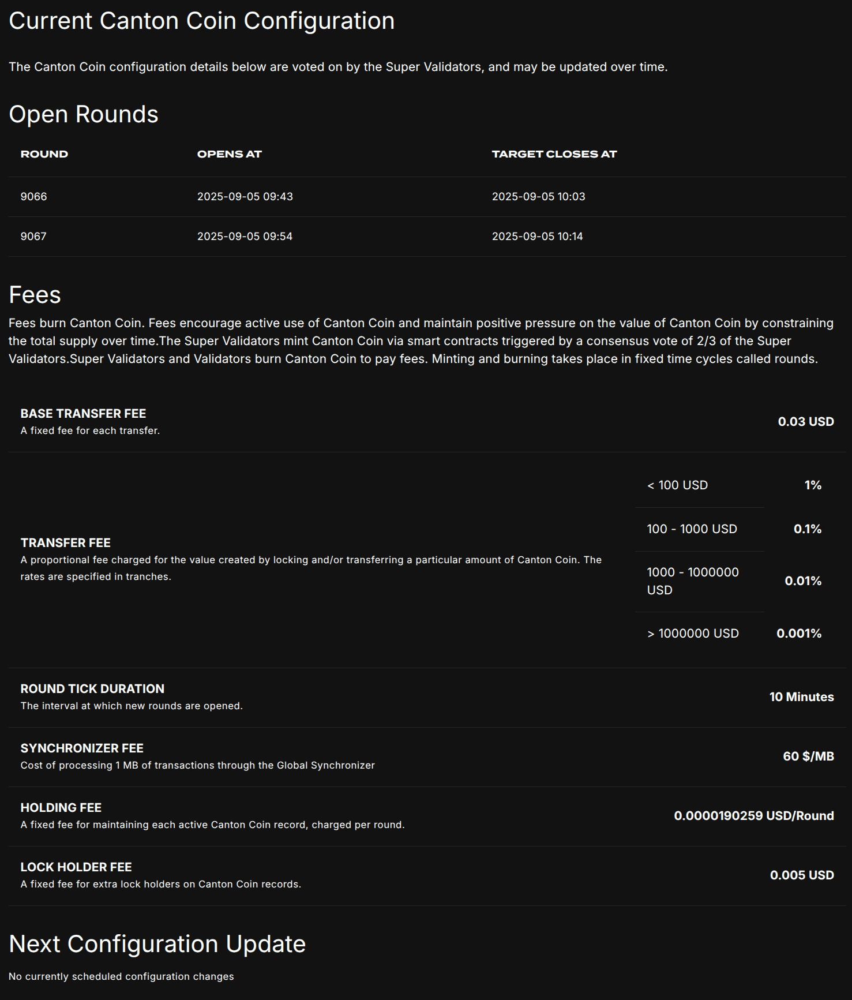
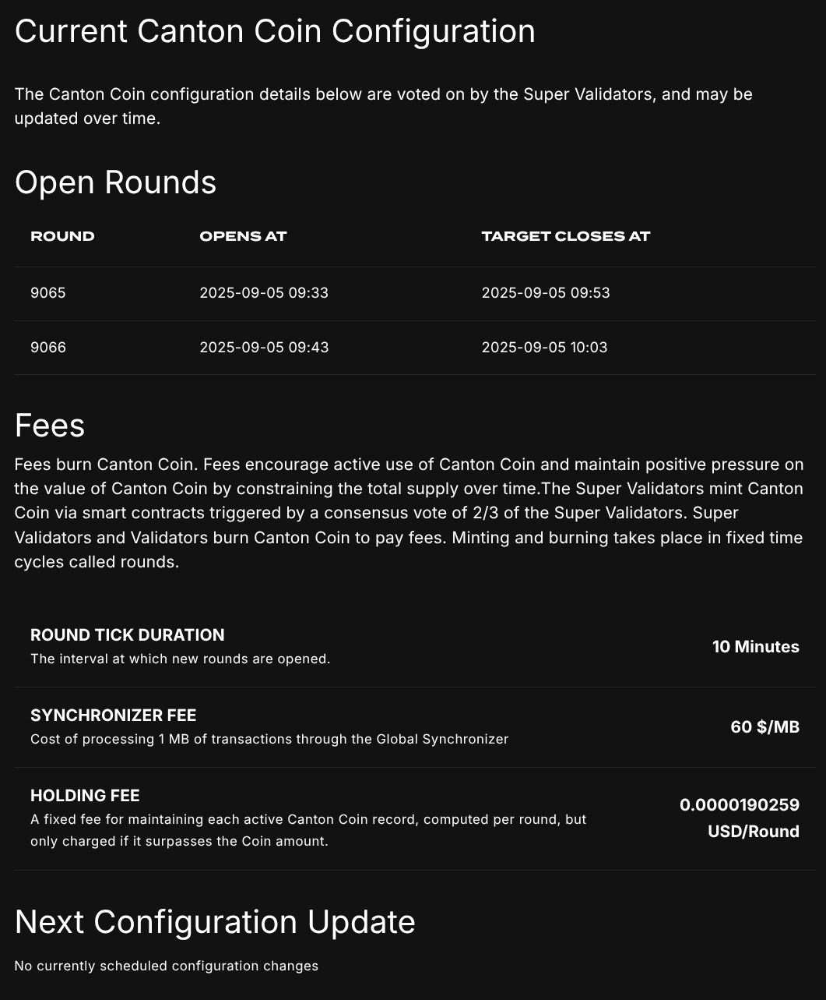
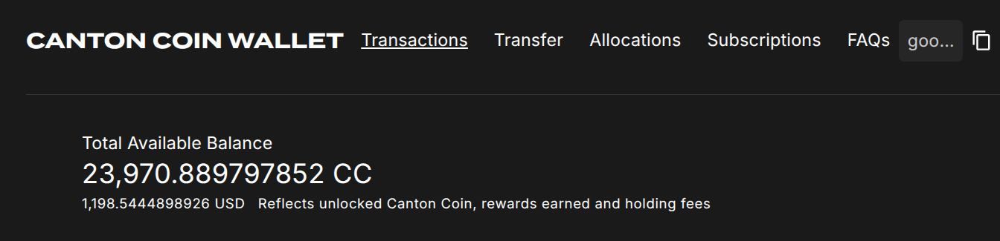
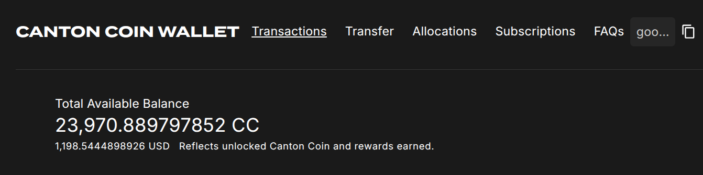

## CIP 0078

<pre>
  CIP:  CIP 0078
  Title: Canton Coin Fee Removal
  Author:
    Simon Meier
  License: CC0-1.0
  Status: Approved
  Type: Tokenomics
  Created: 2025-09-08
  Approved: 2025-09-15
</pre>

## Abstract

This CIP proposes to remove Canton Coin fees and adjust holding fees so that
users do not have to pay fees when transferring Canton Coin and application
developers can build applications without special code to deal with these fees.
This will make Canton Coin, and the Global Synchronizer, more attractive for both users and application
developers.


## Specification

The changes in this CIP are initially implemented as changes to the Amulet Rules configuration where possible,
and changes to the Splice code where necessary.
In the future, the Splice code might be further simplified by completely removing the logic for charging
CC fees on transfers.


### Remove Canton Coin fees

Change the Amulet Rules configuration parameters as follows:

| Configuration                               | Value     |
|---------------------------------------------|-----------|
| `transferConfig.createFee.fee`              | `0.0`     |
| `transferConfig.transferFee.initialRate`    | `0.0`     |
| `transferConfig.transferFee.steps.0._2`     | `0.0`     |
| `transferConfig.transferFee.steps.1._2`     | `0.0`     |
| `transferConfig.transferFee.steps.2._2`     | `0.0`     |
| `transferConfig.lockHolderFee.fee`          | `0.0`     |

Change the Daml code for rewards issuance in `AmuletRules_Transfer` such that featured app rewards
are issued independently of whether CC usage fees were charged.


### Adjust holding Fees

Change the Daml code for Amulet such that no holding fees are charged when using a coin
as an input to a transfer. Combined with the config changes to remove CC fees this
guarantees that the sum of coin inputs is always equal to the sum of coin outputs in a transfer.

SVs retain the ability to expire coins after a time period proportional to the value.
Concretely, they can continue to exercise the `Amulet_Expire` choice
when the holding fees for a coin surpass the initial amount of the coin. These
holding fees continue to be determined as before this CIP using the formula:
```
holdingFees currentRound (ExpiringAmount initialAmount createdAtRound ratePerRound) =
  ratePerRound * (currentRound - createdAt)
```
where the `ExpiringAmount` parameters are stored on the `Amulet` contract and are set
as part of the transfer that created the `Amulet` contract.


### Adjust Splice App UIs

Change UIs to reflect the removal of Canton Coin fees and the adjustment of holding fees,
as shown in the screenshots below.

#### Change Scan UI

From the current state



to this new state



Note the change in the holding fees explanation to

> A fixed fee for maintaining each active Canton Coin record, computed per round, but only charged if it surpasses the Coin amount.

#### Change Splice Wallet UI

From



to



The only change visible in the screenshot is the explanation of the available balance.
However, the UI must also be changed such that
holding fees are not eagerly deducted from the available balance.
This is no longer required, as holding fees
are no longer charged when transferring coins.

No change is required in the Splice Wallet UI to show holding fees getting charged
when the SVs call the `Amulet_Expire` choice.
This is not a new choice, and
the current Splice Wallet UI will display it in the transaction history.


#### Backwards compatibility

This CIP will be voted in by the SVs as a Daml version change that introduces the
holding fees adjustment and a fees config change.
A single Splice release must thus support both the old and new holding fees logic.
The UI should thus check whether the Daml version change has been executed,
and only use the new display logic if it has.

Furthermore, the CC fees displays should be adjusted such that they are hidden when the fees are zero.
Thereby adjusting themselves automatically once the zero fees are voted in
via a config change.


## Motivation

This CIP proposes to remove Canton Coin fees and adjust holding fees so
that users do not have to pay fees when transferring Canton Coin and
application developers can build applications without special code to
deal with these fees. This will make Canton Coin more attractive for both users and
application developers.

Removing these fees is possible because
the majority of burn on MainNet is due to traffic purchases and
because app activity is expected to be tracked using explicit app activity
markers (see [CIP-0047](../cip-0047/cip-0047.md)) instead of extra CC transfers.

From a user perspective, the charging of fees on CC transfers makes CC unnattractive,
as it results in a feeling of constant loss of value, and it makes accounting more challenging.

For developers, there are a number of challenges. Among others:

* **Funding fees in multi-step workflows is cumbersome.** For example, a transfer-offer
  over a fixed amount of CC requires the sender to lock additional CC to pay for the CC fees
  of the actual transfer. This amount of fees is not known at the time of creating the transfer-offer,
  so the sender has to lock more CC than they expect to be needed for the transfer. For example,
  token standard transfers of CC lock 4x the expected CC fees to ensure that the transfer can be executed
  even if the CC fees change in the meantime (see [code](https://github.com/hyperledger-labs/splice/blob/28d17694f42c4b9ff96b6487ab994d43e9879a3c/daml/splice-amulet/daml/Splice/Amulet/TwoStepTransfer.daml#L85-L89)).
  This approach is problematic as it reduces capital efficiency, creates extra change coins that have to
  be merged back into the user's balance, and might nevertheless lead to failed transfers in case the
  CC fees or conversion rate change more than 4x.

* **CC fee accounting is challenging.** CC is a financial asset, which requires accurate financial accounting of the CC balance of users.
  Thus any application using CC needs to implement logic to account for the CC fees and book them properly.

  In particular, CC fees are non-standard compared to other tokens.
  The [Canton Network Token Standard](https://github.com/global-synchronizer-foundation/cips/blob/main/cip-0056/cip-0056.md)
  thus only has minimal support to report the total amount of burned assets on a transfer.
  Token standard wallets that want to show detailed CC fees thus need to implement CC-specific logic
  to parse the actual CC transaction details and extract the CC fees from them. Likewise, providing a preview on
  the CC fees would also require the wallet to implement CC-specific logic to reimplment the CC fee calculation.

* **Application design overhead** every application using CC needs to design a CC fee funding workflow in addition
  to the actual value-adding application workflow, and decide
  how the fees are split between the different parties involved in the application. Furthermore, their UI design
  needs to account for the CC fees and show them to users in a way that is understandable. All of this is
  overhead that distracts developers from building the core functionality of their application.

These are non-trivial challenges that do not seem worth the benefit of the extra burn pressure that CC fees create.


## Rationale

### Burn on MainNet

To substantiate the claim that the majority of burn on MainNet is due to traffic purchases,
we can look at the burn statistics for MainNet.
In the 3 month time period from 2025-05-14 to 2025-08-14,
the total burn on MainNet was 446'680'130 CC out of which
423'475'365 CC were due to traffic purchases. Thus about
94.8% of the burn was due to traffic purchases.

In the future, we expect even more burn due to traffic purchases
when more non-CC assets and workflows are used on Canton Network.
Thus giving up the burn pressure from CC fees seems
worthwhile given the user and developer experience improvements
that removing CC fees and adjusting holding fees brings.


### Not completely removing holding fees

We refrain from completely removing holding fees,
as that would lead to ever-increasing operational costs for SVs
due to the accumulation of "dust coins".

Dust coins are coin contracts whose value is less than the traffic fees it would cost to use them as an input to a transfer. Dust also exists
on other chains like Bitcoin. There it takes the form of UTXOs whose
inclusion in a transaction is uneconomical.

Dust coins are not economically viable to use to fund transfers.
They thus tend to not be used by their owners and accumulate in the active contract set of SV nodes.
This is a problem because contracts in the active contract are stored and indexed in the Postgres DB maintained by SV nodes;
and thus contribute to the operating costs of SV nodes.
Limiting the number of dust coins is therefore important to bound the operating costs of SV nodes.

The mechanism based on the `Amulet_Expire` choice proposed in this CIP
incentivizes coin owners to consolidate their long-term holdings in
coin contracts with higher values; and thus lowers the operating costs of
the SV nodes spent on maintaining these coin contracts.

We expect the mechanism to be de-facto transparent to users, as
even a coin contract with a value of 0.01 \$ will be live for
3.65 days with the `holdingFeeRate` of `1 $/year`. Thus it is unlikely
that there is contention between transactions by coin owners and SVs over the
expiration of a coin contract. Furthermore, requiring users to
consolidate long-term holdings in coin contracts with a value
of 10 \$ or higher so that they are live for at least 10 years seems
reasonable and beneficial for the network.

For developers, the key change in this CIP is that holding fees are not charged
when transferring coins, but only explicitly on expired coin contracts.
The explicit charging via the `Amulet_Expire` choice makes accounting for holding fees
simple in their apps, as exactly the value of the coin contract is charged as holding fees;
and there's an explicit dedicated transaction that signals these fees being charged.
Furthermore, not charging any CC fees on transfers means that developers no longer
have to manage funding CC fees when implementing multi-step
workflows that transfer coins. Developers only have to ensure that workflows
do not rely on very low value coin contracts to be live for a long time,
which we expect to not be a problem in practice.
 s
### Impact on app rewards

Before this CIP, app activity records can be created from CC transfers and featured app activity markers,
which were introduced in [CIP-0047](../cip-0047/cip-0047.md).
Featured app activity markers result in featured app activity records with a weight
set to the `featuredAppActivityMarkerAmount` config parameter converted to CC using the current conversion rate.
Activity records originating from CC transfers are created as follows:

* When a transfer is provided with a `FeaturedAppRight` contract as an input _and_
  the `FeaturedAppRight` matches the app provider specified on the transfer,
  then a featured app activity record is generated with the weight set to the transfer fee plus the
  `extraFeaturedAppRewardAmount` config parameter converted to CC using the current conversion rate.
* When no `FeaturedAppRight` contract is provided as an input to the transfer,
  an unfeatured app activity record is generated with the weight set to the transfer fee.
  Thus a featured app provider can choose whether to feature a CC transfer or not.

Both config parameters are stored in the `AmuletConfig` and set to $1 USD at the time of writing this CIP.

With the removal of CC fees as proposed in this CIP,
no unfeatured app activity records will be generated anymore.
Only CC transfers that are explicitly called with a `FeaturedAppRight` contract matching the specified provider
will generate featured app activity records.
Their weight will be set to the `extraFeaturedAppRewardAmount` converted to CC using the current conversion rate,
as no transfer fees are charged anymore.

Thus both featured CC transfers and featured app activity markers will generate the same featured app activity records.
Going forward featured app activity markers are the preferred way to generate app activity records.
The ability to feature CC transfers directly is retained for backwards compatibility.

## Backwards compatiblity

The configuration changes are backwards compatible by construction.

The adjustment of holding fees is backwards compatible for all apps that parse
the actual holding fees for transactions from the transaction details, which works as:
* The `TransferSummary.holdingFees` field will continue to be present, but it will always contain a zero value.
* The meaning of the `Amulet_Expire` transaction is unchanged:
  it charges exactly `Amulet.amount.initialAmount` in holding fees.

Apps that attempt to predict holding fees, need to adjust their UIs and logic to
not deduct holding fees when calculating CC transfer fees.


## Reference implementation

Reference implementations of the Daml changes for this CIP is available in [this PR](https://github.com/hyperledger-labs/splice/pull/2138).


## Copyright

This CIP is licensed under CC-1.0.

## Changelog

* **2025-09-08:** Draft ready for review
* **2025-09-15:** CIP Approved.

