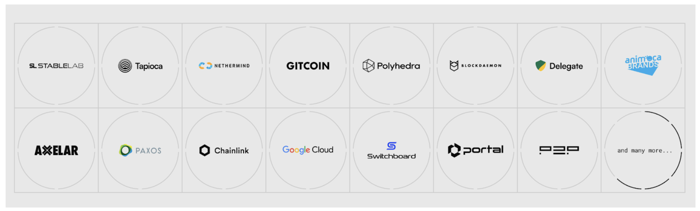

## CIP 00XX

<pre>
  CIP: CIP 00XX
  Title:  Canton x LayerZero
  Author: 
    Eric Saraniecki
  Status: Draft 
  Type: Governance 
  Created: 2025-05-06
  Approved: TBD
  License: CC0-1.0
</pre>

# Table of Contents

* [Abstract](#abstract)
    * [About Applicant](#about-applicant)
    * [Deliverables for full SV reward](#deliverables-for-full-sv-reward)
        * [SV Mechanics](#sv-mechanics)
* [Appendix I](#appendix-i)
    * [Benefits of LayerZero Protocol](#benefits-of-layerzero-protocol)
        * [Application-Owned Security Model](#application-owned-security-model)
        * [Pathway Ownership](#pathway-ownership)
        * [Universal Composability](#universal-composability)
        * [Unified Liquidity](#unified-liquidity)
        * [Inventory Management](#inventory-management)
    * [Industry References](#industry-references)

## Abstract

Add LayerZero as an SV of weight 4 and establish it as the default interoperability provider for the Canton Network.

## About Applicant

LayerZero Labs, is the leading blockchain infrastructure provider for cross-chain interoperability, allowing data and digital assets to move seamlessly and securely across blockchains. More than 300 omnichain applications are built on LayerZero’s immutable, censorship resistant and permissionless messaging protocol, which has executed over 140 million transactions and has secured in excess of $200 billion in value. 

LayerZero Labs is proposing to develop and support an [Endpoint](https://docs.layerzero.network/v2/concepts/protocol/layerzero-endpoint) for the Canton network, ensuring full integration with the LayerZero mesh network of 125+ blockchains and fully supported [OFT](https://docs.layerzero.network/v2/developers/evm/oft/quickstart) and [OApp](https://docs.layerzero.network/v2/developers/evm/oapp/overview) contract interfaces for assets and applications issued on the Canton network.

LayerZero will deploy and integrate an Endpoint on Canton, providing full messaging capabilities and standardised interoperability between private Canton instances, the public Canton network and the broader LayerZero ecosystem.

By leveraging the Omnichain Fungible Token (OFT) and Omnichain Application (OApp) contract interfaces and the extensive experience in secure smart contract development, LayerZero Labs offers a robust, scalable, and compliant solution tailored to meet the requirements of the Canton Network builders in financial services.

The OFT Standard has multiple benefits, including 1/ it simplifies liquidity management, 2/ eliminates fragmentation, and 3/ offers elastic scalability across a wide range of secondary markets and supports the distribution of assets and the unified communication of applications across systems.

Today, LayerZero is utilized in production by industry leaders such as Ondo Finance, PayPal, USDT0, BitGo, Paxos and many others, showcasing its ability to meet security and compliance requirements at scale. With a proven track record of accounting for over 70% of cross-chain industry messaging volume in 2024, LayerZero Labs is committed to providing a best in class experience to the Canton Network, its members, and users.

## Deliverables for full SV reward

| Deliverable | Acceptance Criteria | Deadline | Weight Earned |
|-------------|---------------------|----------|----------------|
| LayerZero to deploy and integrate a full Endpoint on the Canton Network, becoming the default interoperability provider for the ecosystem | * Assets issued on the Canton Network can be natively bridged to any existing or future network supported by the LayerZero protocol ([full list here](https://docs.layerzero.network/v2/concepts/protocol/layerzero-endpoint)) * Assets issued on any network supported by LayerZero can be natively bridged to Canton * LayerZero supports the Canton Network Token Standard * Full end-to-end messaging is enabled in a point-to-point mesh to/from Canton and the 125+ blockchains LayerZero supports today | +12 Months | 2 |
| Adoption | * LayerZero, through GTM, education, influence, and its efforts routes an increasing amount of assets and applications to Canton See current usage of the LayerZero protocol [here](https://layerzeroscan.com/) | +180 Days from Product Integration | 0.5 per 5 assets/applications (up to 2) |
| Join the Global Synchronizer Foundation | * Fully onboarded as a General Member of the GSF * Logo is on the website * Support public announcement made | +45 Days | 0 |

## SV Mechanics

* An ‘representative’ SV will be setup by the GSF with an SV Weight at the maximum earnable weight in this CIP
    * The Applicant is responsible for all costs associated with the operation of the representative SV
    * The representative SV will NOT mint rewards on a block by block basis
    * All representative SV rewards will go to the Unclaimed Rewards pool
* Applicant is required to present proof of successful completed milestones to the Tokenomics Working Group
    * Applicant is required to present a calculation for number of Canton Coin it should earn for meeting the requirements of the milestone
* If the Tokenomics Working Group agrees the milestone has been met and agrees with the calculation, an announcement will be sent via the Tokenomics-Announce mailing List
    * ⅔ of Super Validator Operators will then assign a portion of the Unclaimed Rewards to be minted by the Applicant’s Validator
    * ⅔ of the Super Validator Operators will update their configurations to allow Applicant to takeover a portion of their SV Weight on a go-forward basis
* If any milestones and associated rewards are not achieved by the deadline
    * Applicant will be notified they have not met a deliverable by the GSF 
    * Remaining SV Weight on the representative SV will be removed from the SV Operator configs
    * The Tokenomics Working Group will make a recommendation to the SVs on what to do with the Unclaimed Rewards 
* Applicant is subject to CIP-0045 : SV Operating Requirements
    * If, at any time, the Applicant has been rewarded SV Weight > 2.5, they are required to operate their SV within 6 months of crossing that Weight

## Appendix I

### Benefits of LayerZero Protocol

#### Application-Owned Security Model

[LayerZero v2](https://medium.com/layerzero-official/introducing-layerzero-v2-076a9b3cb029) introduced Decentralized Verifier Networks (DVNs), offering tailored security for cross-chain messaging. Any participant can operate their own DVN for interoperability, ensuring the security of their assets and other Canton issued asset transfers and have the ability to establish themselves as a trusted option for other third parties in the Canton network. Alternatively, participants can integrate existing DVNs to optimize cross-chain message verification based on specific requirements such as security, cost, and speed. Over 40 DVNs are currently available, including those operated by Google, Blockdaemon, Polyhedra, LayerZero Labs, and [many others](https://docs.layerzero.network/v2/developers/evm/technical-reference/dvn-addresses). There are also adapter DVNs for Chainlink CCIP and other decentralized validation mechanisms if desired.

[Omnichain Fungible Tokens](https://docs.layerzero.network/v2/home/protocol/contract-standards#oft) (OFTs) and [Omnichain Applications](https://docs.layerzero.network/v2/developers/evm/oapp/overview) (OApps) leverage LayerZero’s modular security framework, enabling Canton participants to select their own verification methods for token transfers, as the application owner. This flexibility allows application owners to alter verification methods as desired, utilizing oracles, bridges, chain validators, or any suitable verification mechanism.

For further details on DVNs and their functionality, refer to the provided [link](https://docs.layerzero.network/v2/home/modular-security/security-stack-dvns).

_Figure 4: Sample of DVN Providers_

#### Pathway Ownership

As the application owners, Canton participants have full autonomy of [wiring and un-wiring cross-chain pathways](https://docs.layerzero.network/v2/developers/evm/create-lz-oapp/wiring) for their applications. The application needs to set peers for the sender application address with each destination LayerZero Endpoint ID and the associated receiver application address. Owners of the contract can turn on and off their [set peers](https://docs.layerzero.network/v2/developers/evm/oft/quickstart#setting-trusted-peers) whenever they want, providing them the ability to connect and disconnect the ability for users to transfer assets and communicate. The LayerZero protocol, nor LayerZero Labs, has any ability to turn on or off an application set peers.

#### Universal Composability

OFTs introduce standardization to token operations across various chains. Traditional tokens are often constrained by the rules and standards of their native blockchain, resulting in a fragmented experience when interacting with multiple chains. In contrast, OFTs maintain a consistent standard across all chains they operate on. This uniformity streamlines the user and developer experience, as the token behaves identically regardless of the blockchain used.

Such standardization is invaluable for both developers and users, as it diminishes the complexity and learning curve associated with managing assets across multiple chains. Integration of the OFT Standard can keep token addresses consistent across all chains, simplifying the process for developers and market makers. This feature can significantly reduce the time and resources needed for product managers to incorporate blockchain technology into existing systems.

#### Unified Liquidity

OFTs unify liquidity across networks through fast and secure communication between contracts via burn and mint (user or application initiated). This eliminates the need for wrapped assets ([4/5 largest exploits have occurred with wrapped assets](https://rekt.news/leaderboard/)) and liquidity on multiple chains for bridging via standalone asset pools, paving the way for scalable liquidity across numerous L2s and L1s. In terms of efficiency, OFTs exist as native tokens on each chain, requiring only gas fees for transfer, devoid of additional costs associated with wrapping, bridging, or slippage. OFTs can be natively transferred across any LayerZero Labs supported chains (currently 124) in a point to point flow, without ever needing to redeem on any one base chain, e.g. Ethereum.

#### Inventory Management

OFTs are essential tools for facilitating seamless multi-chain asset management. These tokens enable fast, native transfers across chains, streamlining deposits and withdrawals across any blockchain where they're deployed, eliminating reliance on third-party bridges and reducing settlement times - a critical advantage for effective inventory rebalancing. The unified supply across all chains simplifies the extension to new blockchains, broadening access to diverse ecosystems rapidly, when needed.

Moreover, OFTs optimize liquidity management across different blockchains and exchanges efficiently. The ability to transfer tokens freely negates the necessity for maintaining fragmented inventories across chains. Market makers can centralize their token reserves, deploying them as needed to capitalize on arbitrage opportunities or to provide liquidity, enhancing market stability and efficiency by being able to seamlessly rebalance across chains via burn and mint without having to wait multiple day escrow periods that are inherent to native bridges going to and from L2s.

## Industry References

**[PayPal's PYUSD stablecoin](https://layerzero.network/blog/paypal-usd-pyusd-integrates-layerzero)**, has gained significant traction in DeFi with a market capitalization exceeding $0.5 billion. A major driver of its growth has been its integration into DeFi protocols, particularly on the Solana and Ethereum blockchains. PYUSD has found notable use in liquidity pools. Additionally, platforms offer attractive yields on PYUSD, contributing to its adoption. PYUSD is regulated under the NYDFS and currently LayerZero is the only interoperability protocol approved by the regulator for cross-chain composability and designed on behalf of PayPal, a regulatory compliant solution for cross-chain transfer.

* Try for yourself [here](https://stargate.finance/bridge?srcChain=ethereum&srcToken=0x6c3ea9036406852006290770BEdFcAbA0e23A0e8&dstChain=solana&dstToken=2b1kV6DkPAnxd5ixfnxCpjxmKwqjjaYmCZfHsFu24GXo)
* All transactions can be seen [here](https://layerzeroscan.com/protocol/paypal)

**USDT0 Team** collaborated with LayerZero to co-build complete interoperability across new chains ([via the new USDT0 asset and OFT Standard](https://mirror.xyz/tetherzero.eth/4z1kh9wE6h07zGjrKImx4Cr-VIzCpRle0VElalG0Rss)) and existing chains ([via the USDT Legacy Mesh powered by LayerZero messaging](https://mirror.xyz/tetherzero.eth/NUSP9nxicfUulDFjEyXRC3LHUtL2c23fxRdE_3M79Es)).

* Try for yourself [here](https://usdt0.to/transfer)
* All transactions can be seen [here](https://layerzeroscan.com/protocol/usdt0)

**[BitGo’s Wrapped Bitcoin (WBTC), ](https://layerzero.network/blog/layerzero-selected-by-bitgo-for-wbtc)** a tokenized form of Bitcoin on the Ethereum blockchain, currently holds a market capitalization of around $14 billion, with over 148,000 WBTC in circulation. Its Total Value Locked (TVL) in DeFi exceeds $10 billion. WBTC allows Bitcoin holders to participate in Ethereum-based DeFi applications, including lending, borrowing, and yield farming. It is widely integrated into major DeFi protocols for lending, liquidity provisioning, and stablecoin swapping. LayerZero has enabled BitGo to expand WBTC to BNB, Base, Sei and Avalanche within two weeks of engineering work and plan to expand WBTC to Uni and Movement before the end of 2024.

* Try for yourself [here](https://stargate.finance/bridge?srcChain=ethereum&srcToken=0x2260FAC5E5542a773Aa44fBCfeDf7C193bc2C599&dstChain=bsc&dstToken=0x0555E30da8f98308EdB960aa94C0Db47230d2B9c)
* All transactions can be seen [here](https://layerzeroscan.com/protocol/wbtc)

**[Ondo Finance's USDY token](https://layerzero.network/blog/ondo-finance-goes-omnichain-with-layerzero)**, backed by U.S. Treasuries, currently has a market capitalization of approximately $384 million. The total value locked across its products exceeds $600 million, with USDY contributing the largest share. This yield-bearing stablecoin is integrated into major decentralized finance (DeFi) ecosystems, and is used in applications for liquidity provisioning, lending, and other DeFi functionalities. LayerZero is actively working with Ondo to bring USDY to Mantle, Ethereum, Arbitrum, Solana and Aptos. USDY operates under Regulation S of the SEC. More detail on their LayerZero implementation can be found in their documentation [here](https://docs.ondo.finance/tools/ondo-bridge#introduction).

* Try for yourself [here](https://ondo.finance/bridge)
* All transactions can be seen [here](https://layerzeroscan.com/protocol/ondo)

**Ethena** adopted LayerZero’s OFT standard to expand USDe, sUSDe, and ENA across 10 ecosystems, achieving over $2 billion in cross-chain transaction volume. USDe’s rapid growth highlights LayerZero’s ability to facilitate scalable, compliant, and efficient cross-chain movement, with built-in security features such as blacklisting and controlled access mechanisms ensuring seamless asset management.

* Try for yourself [here](https://stargate.finance/bridge?srcChain=ethereum&srcToken=0x4c9EDD5852cd905f086C759E8383e09bff1E68B3&dstChain=mantle&dstToken=0x5d3a1Ff2b6BAb83b63cd9AD0787074081a52ef34)
* All transactions can be seen [here](https://layerzeroscan.com/protocol/ethena)

**JP Morgan, WisdomTree and Apollo** worked with LayerZero in Project Guardian. LayerZero facilitated seamless cross-chain messaging across two portfolios of digital assets via the OApp standard. This collaboration is changing how traditional finance interacts with blockchain, enhancing liquidity, efficiency, and security across platforms. 

* Read the report [here](https://www.jpmorgan.com/kinexys/content-hub/project-guardian)
## Copyright

This CIP is licensed under CC0-1.0: [Creative Commons CC0 1.0 Universal](https://creativecommons.org/publicdomain/zero/1.0/).

## Changelog

* **2025-05-06:** Initial draft of the proposal.